<h1 align="center">Hi, I'm Temzzz 👋</h1>

---

## 👋 About Me

🐍 I'm currently improving my **Python** skills through pet projects, startups, real-world projects and experimentation  
🤖 I enjoy **automating every process I can get my hands on**  
🛠️ Currently improving my knowledge of **PostgreSQL, Linux and Docker**

---

## 💻 Tech Stack

---

## 📊 GitHub Stats

  
  

---

  <i>“I am not hated.”</i>

  — <b>Giyu Tomioka</b>

